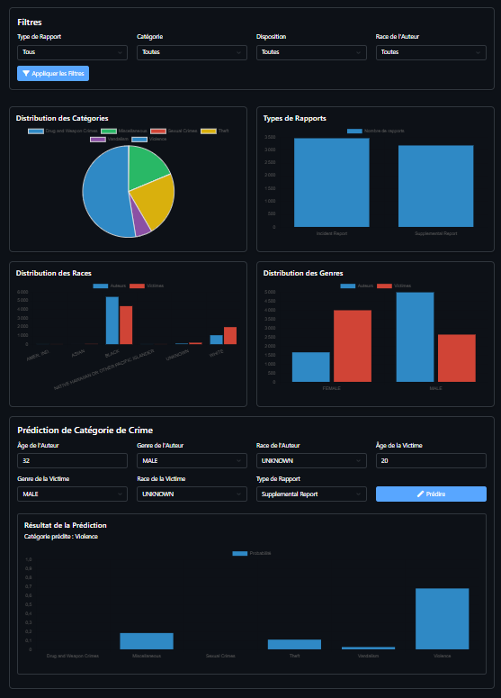

# CrimeSight - Analyse et Prédiction de Crimes

CrimeSight permet d'analyser et de prédire les catégories de crimes basée sur un ensemble de données criminelles. L'application offre une interface moderne avec des visualisations interactives et des fonctionnalités de prédiction.

<div align="center">
  
</div>

## À propos du Projet

CrimeSight permet aux utilisateurs de :
- Visualiser la distribution des crimes par catégorie
- Analyser les tendances par type de rapport
- Explorer les caractéristiques démographiques des auteurs et des victimes
- Prédire la catégorie de crime basée sur des caractéristiques spécifiques

### Dataset

Le projet utilise un dataset de crimes incluant les informations suivantes :
- Caractéristiques des auteurs (âge, genre, race)
- Caractéristiques des victimes (âge, genre, race)
- Type de rapport
- Catégorie de crime
- Disposition du cas

## Installation

### Option 1 : Installation avec Docker (Recommandée)

1. Assurez-vous d'avoir Docker et Docker Compose installés sur votre machine
2. Clonez le repository :
```bash
git clone https://github.com/votre-username/CrimeSight.git
cd CrimeSight
```

3. Construisez et démarrez les conteneurs :
```bash
docker-compose up --build
```

4. Accédez à l'application dans votre navigateur : `http://localhost:5000`

Pour arrêter l'application :
```bash
docker-compose down
```

### Option 2 : Installation Manuelle

1. Clonez le repository :
```bash
git clone https://github.com/votre-username/CrimeSight.git
cd CrimeSight
```

2. Créez un environnement virtuel Python (recommandé) :
```bash
python -m venv venv
source venv/bin/activate  # Sur Windows : venv\Scripts\activate
```

3. Installez les dépendances :
```bash
pip install -r requirements.txt
```

4. Lancez l'application Flask :
```bash
python app.py
```

5. Accédez à l'application dans votre navigateur : `http://localhost:5000`

## Développement

Pour le développement, vous pouvez utiliser les commandes Docker suivantes :

- Voir les logs en temps réel :
```bash
docker-compose logs -f
```

- Reconstruire l'image après des modifications :
```bash
docker-compose up --build
```

- Arrêter et supprimer les conteneurs :
```bash
docker-compose down
```